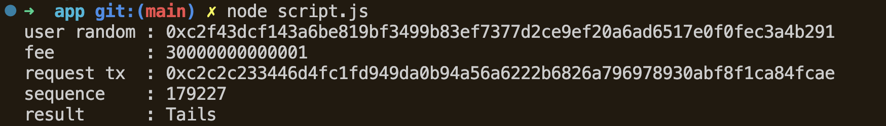

## Run the demo via application

Note : Ensure you have followed the README in the "contracts" folder first.

Go to "app" folder and run below commands - 

```bash
npm install
node script.js
```

This is how the output will look like

